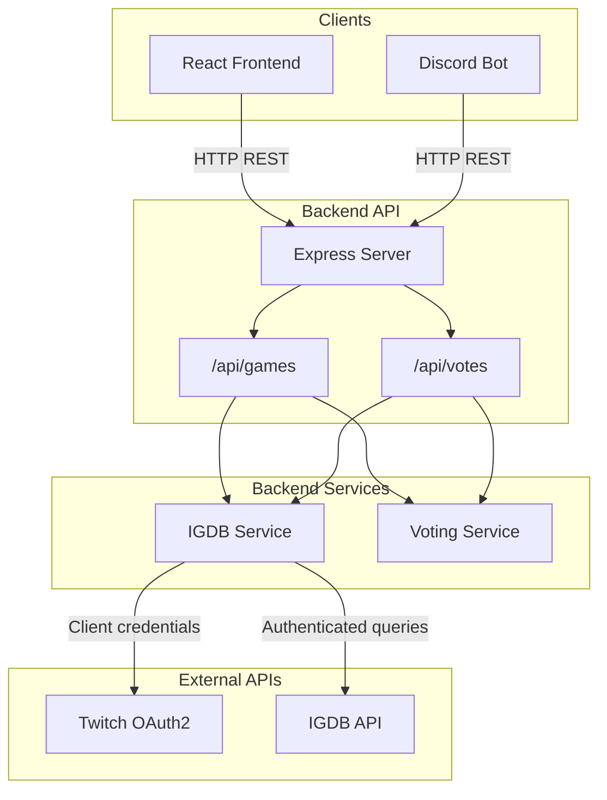

# 🎮 IGDB Game Voting App

A full-stack application that allows users to vote on games using the [IGDB API](https://api-docs.igdb.com). The app can be deployed as both a React web application and a Discord bot, with votes shared between both platforms. Users vote on games based on categories until the top 100 games are determined.


## ✨ Features

- 🎮 **Game Search**: Search and browse games from the IGDB database
- 🗳️ **Voting System**: Vote on games with category-based classification
- 📊 **Real-time Leaderboard**: Track the top 100 voted games in real-time
- 🤖 **Discord Bot**: Vote and interact via Discord slash commands
- 🌐 **Modern Web UI**: Beautiful, responsive React interface
- 🔄 **Cross-Platform**: Votes sync between web and Discord platforms
- 📈 **Statistics Dashboard**: View comprehensive voting statistics

## 🏗️ Architecture



The React app and Discord bot call the Express backend. The backend exposes `/api/games` and `/api/votes`, which use IGDB Service (Twitch token → IGDB API) and Voting Service (in-memory votes and game cache).

## 🏗️ Project Structure

```
IGDB-Voting/
├── backend/          # Express.js API server (TypeScript)
│   ├── src/
│   │   ├── app.ts    # Express app (exported for tests)
│   │   ├── routes/   # API routes
│   │   ├── services/ # Business logic (IGDB, Voting, Ladder)
│   │   ├── models/   # Data models
│   │   └── db/       # SQLite + mock fallback
│   ├── vitest.config.ts
│   └── package.json
├── frontend/         # React web application (TypeScript)
│   ├── src/
│   │   └── components/
│   └── package.json
├── discord-bot/      # Discord bot (TypeScript)
│   ├── src/
│   └── package.json
├── scripts/
│   └── smoke-test.js # Optional HTTP smoke checks
├── .nvmrc           # Node version specification
├── .gitignore       # Git ignore rules
└── README.md
```

## 📋 Prerequisites

- **Node.js** >= 20.0.0 (recommended: 24.12.0)
- **npm** >= 10.0.0 (recommended: 11.6.2)
- **IGDB API Credentials** (via Twitch Developer Portal)
- **Discord Bot Token** (for Discord bot functionality)

### Getting IGDB API Credentials

1. Go to [Twitch Developer Portal](https://dev.twitch.tv/console/apps)
2. Click "Register Your Application"
3. Fill in:
   - **Name**: Your app name
   - **OAuth Redirect URLs**: `http://localhost` (required but not used)
   - **Category**: Any
4. Click "Create"
5. Click "Manage" on your application
6. Click "New Secret" to generate a Client Secret
7. Copy your **Client ID** and **Client Secret**

### Getting Discord Bot Token

1. Go to [Discord Developer Portal](https://discord.com/developers/applications)
2. Click "New Application"
3. Give it a name and click "Create"
4. Go to the **Bot** section
5. Click "Add Bot" → "Yes, do it!"
6. Under **Token**, click "Reset Token" and copy it
7. Enable **Message Content Intent** under "Privileged Gateway Intents"
8. Go to **OAuth2** → **URL Generator**
9. Select scopes: `bot` and `applications.commands`
10. Select bot permissions: "Send Messages", "Use Slash Commands"
11. Copy the generated URL and open it in a browser to invite the bot to your server
12. Copy your **Application ID** (Client ID) from the "General Information" page

## 🚀 Quick Start

### 1. Clone the Repository

```bash
git clone <your-repo-url>
cd IGDB-Voting
```

### 2. Install Dependencies

```bash
# Install all dependencies at once
npm run install:all

# Or install individually:
cd backend && npm install
cd ../frontend && npm install
cd ../discord-bot && npm install
```

### 3. Configure Environment Variables

#### Backend Configuration

Create `backend/.env`:

```env
# IGDB API Credentials (from Twitch Developer Portal)
IGDB_CLIENT_ID=your_client_id_here
IGDB_CLIENT_SECRET=your_client_secret_here

# Server Configuration
PORT=3001
NODE_ENV=development

# CORS Configuration
FRONTEND_URL=http://localhost:3000
```

#### Discord Bot Configuration

Create `discord-bot/.env`:

```env
# Discord Bot Configuration
DISCORD_TOKEN=your_discord_bot_token_here
DISCORD_CLIENT_ID=your_discord_client_id_here

# Backend API URL
API_BASE_URL=http://localhost:3001/api
```

#### Frontend Configuration (Optional)

Create `frontend/.env` (optional, defaults to localhost:3001):

```env
VITE_APP_API_URL=http://localhost:3001/api
# Optional: default guild when none in URL. For multi-guild deployments, omit this; guild comes from URL (/app?guildId=...) or landing page server picker.
# VITE_APP_GUILD_ID=your_discord_server_id
```

For local dev you can omit `VITE_APP_GUILD_ID` and use the landing page, `/ladder link` from Discord, or `?guildId=...` in the URL.

### 4. Start the Application

You'll need **three terminal windows**:

#### Terminal 1 - Backend
```bash
cd backend
npm run dev
```
Backend runs on `http://localhost:3001`

#### Terminal 2 - Frontend
```bash
cd frontend
npm start
```
Frontend runs on `http://localhost:3000`

#### Terminal 3 - Discord Bot
```bash
cd discord-bot
npm run dev
```
Bot will connect to Discord

## 📖 Usage

### Web Application

1. Open `http://localhost:3000` in your browser
2. **Landing page** (`/`): If no server is selected, you see instructions to get the link from your Discord server. Use `/ladder link` in Discord to get your server's voting URL, or select a server from the list (if any) or enter a Discord server ID.
3. **Voting app** (`/app`): Once you have a server context (from URL or landing):
   - **Vote Tab**: Search for games, select one, choose a category, click "Submit Vote"
   - **Top Games Tab**: View the current top 100 games ranked by votes
   - **Statistics Tab**: View comprehensive voting statistics
   - **Ladder Tab**: View nominations or bracket and vote on matchups (when a server is selected)

### Discord Bot Commands

All vote/top/stats commands are scoped to the server where you run them.

- `/nominate game:<name> category:<category>` - Nominate a game for this server's ladder
  - Example: `/nominate game:Minecraft category:Adventure`
- `/vote matchup_id:<id> choice:<A|B>` - Vote in a bracket matchup (use `/ladder show` to see matchup IDs)
- `/search query:<name>` - Search for games
- `/top [limit:<number>]` - View top nominated games for this server (default: 10, max: 100)
- `/stats` - View voting statistics for this server
- `/games category:<id> [limit:<number>]` - Get games by IGDB category ID
- `/ladder show` - Show current ladder (nominations list or bracket matchups with vote buttons)
- `/ladder link` - Get the web app URL for this server's voting page (requires `FRONTEND_URL` in bot env)
- `/ladder start [size:8|16|32]` - Start a new ladder (admin)
- `/ladder close-nominations` - Close nominations and seed bracket (admin)
- `/ladder close-round` - Close current bracket round and advance (admin)

For Discord permissions and invite setup, see [discord-bot/DISCORD-PERMISSIONS.md](discord-bot/DISCORD-PERMISSIONS.md).

### Initial testing flow

1. Invite the bot to your Discord server (OAuth2 URL Generator with `bot` + `applications.commands` scopes).
2. In Discord, run `/ladder start` (admin) to create a ladder.
3. Have users run `/nominate game:<name> category:<category>` to nominate games.
4. Run `/ladder link` to get the web app URL for this server; share it with users.
5. Open the web app link in a browser and verify Vote, Top Games, Stats, and Ladder tabs.
6. When ready, admin runs `/ladder close-nominations` to seed the bracket, then `/ladder close-round` to advance rounds until a champion is chosen.

## 🔌 API Endpoints

### Games

- `GET /api/games/search?q=<query>&limit=<number>` - Search games
- `GET /api/games/category/:categoryId?limit=<number>` - Get games by category
- `GET /api/games/:gameId` - Get game by ID
- `GET /api/games/categories/list` - Get all categories

### Votes (guild-scoped)

All vote endpoints require `guildId` (query or body) so each Discord server has its own ladder.

- `POST /api/votes` - Submit a nomination vote (Phase 1 only)
  ```json
  {
    "guildId": "discord_server_snowflake",
    "gameId": 123,
    "gameName": "Game Name",
    "category": "Action",
    "userId": "user123",
    "platform": "web" | "discord"
  }
  ```
- `GET /api/votes/top?guildId=<id>&limit=<number>` - Get top nominated games for a guild
- `GET /api/votes/game/:gameId?guildId=<id>` - Get votes for a game in a guild
- `GET /api/votes/stats?guildId=<id>` - Get voting statistics for a guild
- `DELETE /api/votes/clear?guildId=<id>` - Clear nomination votes for a guild (admin)

### Guilds

- `GET /api/guilds` - List all guilds (servers) that have been used (for landing page server picker)

### Ladder (per-guild)

- `GET /api/guilds/:guildId/ladder` - Get current ladder state (phase, top games, or bracket matchups with vote counts)
- `POST /api/guilds/:guildId/ladder/start` - Start a new ladder (body: `{ "bracketSize": 16 }`). Admin: `X-Admin-Secret` header or `ADMIN_SECRET` env.
- `POST /api/guilds/:guildId/ladder/matchup-vote` - Vote in bracket phase (body: `matchupId`, `votedGameId`, `userId`, `platform`)
- `POST /api/guilds/:guildId/ladder/close-nominations` - Close nominations and seed bracket (admin)
- `POST /api/guilds/:guildId/ladder/close-round` - Close current round and create next round or set champion (admin)

### Health Check

- `GET /health` - Server health status

## 🎯 IGDB Category IDs

Common category IDs for the `/games` command:

- `0` - Main Game
- `1` - DLC/Add-on
- `2` - Expansion
- `3` - Bundle
- `4` - Standalone Expansion
- `5` - Mod
- `6` - Episode
- `7` - Season
- `8` - Remake
- `9` - Remaster
- `10` - Expanded Game
- `11` - Port
- `12` - Fork
- `13` - Pack
- `14` - Update

## 🚢 Deployment

Deployment is split: **frontend** (static site) and **backend** (Node + SQLite). The frontend calls the backend using `VITE_APP_API_URL`. GitHub Pages can host only the frontend; the backend must run on a Node host (e.g. Railway, Render).

### Backend Deployment

1. Build the TypeScript code:
   ```bash
   cd backend
   npm run build
   ```

2. Set environment variables on your hosting platform:
   - **Required**: `IGDB_CLIENT_ID`, `IGDB_CLIENT_SECRET`, `PORT` (if not 3001)
   - **CORS**: `FRONTEND_URL` — origin of your frontend (e.g. `https://your-username.github.io` or your custom domain)
   - **Database**: `DATABASE_PATH` (optional; default `./data/voting.db`). Ensure the path is writable (e.g. use a persistent volume on Railway/Render).
   - **Admin**: `ADMIN_SECRET` (optional; for protected ladder/vote-clear endpoints)

3. Start the server:
   ```bash
   npm start
   ```

**Recommended Platforms**: Railway, Render, Fly.io, Heroku, DigitalOcean, AWS EC2

If `better-sqlite3` native bindings fail to build (e.g. on Windows without build tools), you can run the backend with **mock DB** (no persistence): set `USE_MOCK_DB=1`. Votes and ladder data will be in-memory only. See [backend/.env.example](backend/.env.example).

### Frontend Deployment

1. Build the React app (output is `frontend/dist/`):
   ```bash
   cd frontend
   npm run build
   ```
   Set `VITE_APP_API_URL` at **build time** to your deployed backend API URL (e.g. `https://your-backend.up.railway.app/api`). For multi-guild deployments, omit `VITE_APP_GUILD_ID`; guild context comes from the URL or landing page server picker.

2. Deploy the `frontend/dist` folder to your hosting platform.

**Recommended Platforms**: Vercel, Netlify, GitHub Pages

### GitHub Pages (frontend)

1. In the repo **Settings → Pages**, set **Source** to **GitHub Actions**.
2. Add **repository variables** (Settings → Secrets and variables → Actions → Variables):
   - `VITE_APP_API_URL`: your deployed backend URL (e.g. `https://your-backend.up.railway.app/api`)
   - `VITE_APP_GUILD_ID`: (optional) default Discord server ID when none in URL
3. Push to `main` or run the workflow **Deploy frontend to GitHub Pages** manually. The workflow builds the frontend and deploys it to GitHub Pages.
4. **URLs**:
   - **Frontend (Pages)**: `https://<your-username>.github.io/<repo-name>/` (or your custom domain if configured).
   - **Backend (API)**: whatever you set as `VITE_APP_API_URL` (e.g. Railway or Render URL).

### Discord Bot Deployment

The bot is a **long-running process** (no HTTP server). It needs to stay online to receive Discord gateway events.

#### Run the bot from your machine (e.g. against deployed backend)

Use this to test without Render’s worker. Your machine must stay on and the bot process running for Discord commands to work.

1. **Create `discord-bot/.env`** (copy from `discord-bot/.env.example`):
   - `DISCORD_TOKEN` – your Discord bot token ([Discord Developer Portal](https://discord.com/developers/applications) → your app → Bot → Reset Token).
   - `DISCORD_CLIENT_ID` – your Discord application Client ID (same app → OAuth2 → Client ID).
   - `API_BASE_URL` – your **deployed** backend API base URL, e.g. `https://igdb-voting-backend.onrender.com/api` (no trailing slash). This makes the bot talk to your live backend and share votes with the web app.
   - `FRONTEND_URL` – (optional) frontend URL for `/ladder link` (e.g. `https://your-app.onrender.com`). Defaults to `http://localhost:3000`.
   - `ADMIN_SECRET` – (optional) set only if your backend has `ADMIN_SECRET`; must match for admin slash commands.

2. **Install and run** (from repo root or from `discord-bot/`):
   ```bash
   cd discord-bot
   npm install
   npm run build
   npm start
   ```
   Or for development with hot reload: `npm run dev`.

3. **Invite the bot** to your Discord server: Discord Developer Portal → your app → OAuth2 → URL Generator → scopes `bot` and `applications.commands`, bot permissions (e.g. Send Messages, Use Slash Commands) → open the generated URL and add the bot to a server.

4. Keep the terminal (or process) running; closing it stops the bot.

#### Option A: Render (same repo as backend)

If you use the repo’s **Render Blueprint** (`render.yaml`), the Discord bot is defined as a **background worker**. After linking the repo to Render:

1. **Sync the Blueprint** so the `igdb-voting-discord-bot` worker service is created.
2. In the Render Dashboard, open **igdb-voting-discord-bot** → **Environment** and set:
   - `DISCORD_TOKEN` – your Discord bot token
   - `DISCORD_CLIENT_ID` – your Discord application client ID
   - `API_BASE_URL` – your backend API base URL, e.g. `https://igdb-voting-backend.onrender.com/api`
   - `ADMIN_SECRET` – (optional) must match backend’s `ADMIN_SECRET` for admin slash commands
3. Deploy; the worker will build (`npm install && npm run build`) and run `npm start`.

**Note:** Background workers on Render do not support the free plan; use at least **Starter**. The bot only redeploys when files under `discord-bot/` change (build filter in `render.yaml`).

**If you get "Sync Error: id is empty"** when syncing the Blueprint, Render’s sync can fail when the Blueprint was created with only one service (e.g. backend) and you later add another (the worker). Try one of these:

- **Workaround 1 – Create the worker manually:** In the Render Dashboard go to **New → Background Worker**. Connect the same repo, set **Root Directory** to `discord-bot`, **Build Command** to `npm install && npm run build`, **Start Command** to `npm start`, and set the env vars listed above. You can leave `render.yaml` as-is (the backend stays managed by the Blueprint; the worker is standalone).
- **Workaround 2 – New Blueprint with both services:** Create a **new** Blueprint (New → Blueprint → connect the same repo, same branch). When Render shows that the Blueprint matches existing resources, choose **Create New Resources** so it creates a new backend + worker pair. Then retire or delete the old backend if you were using one.

#### Option B: Other platforms

1. Build the TypeScript code:
   ```bash
   cd discord-bot
   npm run build
   ```
2. Set environment variables (see `discord-bot/.env.example`): `DISCORD_TOKEN`, `DISCORD_CLIENT_ID`, `API_BASE_URL`, and optionally `ADMIN_SECRET`.
3. Start the bot:
   ```bash
   npm start
   ```

**Recommended Platforms**: Render (worker), Railway, Fly.io, Heroku, DigitalOcean (for 24/7 hosting)

## 🛠️ Development

### Available Scripts

#### Root Level
- `npm run install:all` - Install dependencies for all projects
- `npm run dev:backend` - Start backend in development mode
- `npm run dev:frontend` - Start frontend in development mode
- `npm run dev:bot` - Start Discord bot in development mode
- `npm run build:backend` - Build backend for production
- `npm run build:frontend` - Build frontend for production
- `npm run build:bot` - Build Discord bot for production
- `npm run test` - Run backend test suite
- `npm run test:frontend` - Run frontend test suite
- `npm run smoke` - Run HTTP smoke checks (backend must be running)

#### Backend
- `npm run dev` - Start development server with hot reload
- `npm run build` - Build TypeScript to JavaScript
- `npm start` - Start production server
- `npm run test` - Run Vitest tests (unit + integration)

#### Frontend
- `npm start` - Start development server
- `npm run build` - Build for production
- `npm run test` - Run Vitest + React Testing Library tests

#### Discord Bot
- `npm run dev` - Start bot in development mode with hot reload
- `npm run build` - Build TypeScript to JavaScript
- `npm start` - Start bot in production mode

### Tech Stack

- **Backend**: Express.js, TypeScript, Axios, SQLite (better-sqlite3)
- **Frontend**: React, TypeScript, Axios, Vite
- **Discord Bot**: Discord.js, TypeScript, Axios
- **Testing**: Vitest, supertest, React Testing Library
- **API**: IGDB API (via Twitch OAuth)

### Testing

The project uses **Vitest** for unit and integration tests. Tests run against a mock DB (no SQLite bindings required).

- **Backend tests** (`backend/`): voting service, ladder service, votes routes (26 tests)
- **Frontend tests** (`frontend/`): App component (tab switching, guildId from URL) (8 tests)

```bash
# Run backend tests
cd backend && npm run test

# Run frontend tests
cd frontend && npm run test

# Or from root
npm run test
npm run test:frontend
```

## ⚠️ Important Notes

- **Persistence**: Votes and ladders are stored in SQLite (default: `backend/data/voting.db`). Set `DATABASE_PATH` in the backend to override. Data survives restarts. If `better-sqlite3` native bindings are missing (e.g. Windows without build tools), the backend falls back to an in-memory mock DB automatically, or set `USE_MOCK_DB=1` to force it; no data is persisted in mock mode.
   - **Ladder flow**: Per Discord server: (1) **Nominations** – users nominate games with `/nominate` or the web app; (2) admin runs **close-nominations** to seed a bracket from the top N; (3) **Bracket** – users vote on head-to-head matchups (Discord buttons, `/vote` command, or web Ladder tab); (4) admin runs **close-round** until one champion remains.
- **User voting**: One nomination per user per game per guild; one vote per user per matchup in the bracket.
- **Multi-guild support**: One deployment serves multiple Discord servers. Guild context comes from the URL (`/app?guildId=...`), the landing page server picker, or `/ladder link` in Discord. Optionally set `VITE_APP_GUILD_ID` for a default server’s ladder.
- **Environment Variables**: Never commit `.env` files to version control. Always use `.env.example` files as templates.

## 🔒 Security

- All environment variables are excluded from git via `.gitignore`
- Never commit API keys, tokens, or secrets
- Use environment variables for all sensitive configuration
- The `.env` files are already in `.gitignore` and will not be committed

## 🤝 Contributing

Contributions are welcome! Please feel free to submit a Pull Request.

1. Fork the repository
2. Create your feature branch (`git checkout -b feature/AmazingFeature`)
3. Commit your changes (`git commit -m 'Add some AmazingFeature'`)
4. Push to the branch (`git push origin feature/AmazingFeature`)
5. Open a Pull Request

## 📝 License

This project is licensed under the ISC License.

## 🙏 Acknowledgments

- [IGDB API](https://api-docs.igdb.com) for game data
- [Discord.js](https://discord.js.org/) for Discord bot functionality
- [React](https://react.dev/) for the web interface

## 📧 Support

If you encounter any issues or have questions, please open an issue on GitHub.

---

**Made with ❤️ for the gaming community**
